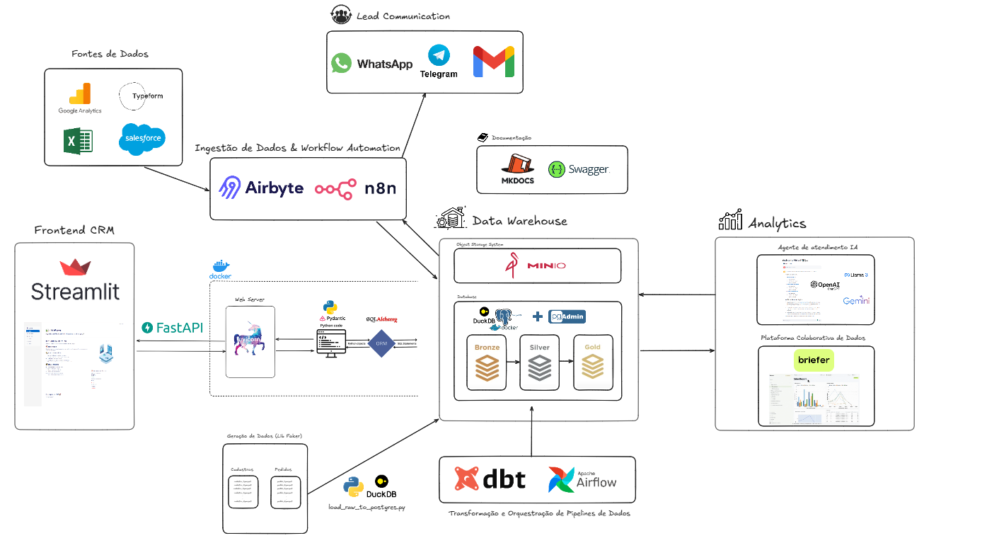
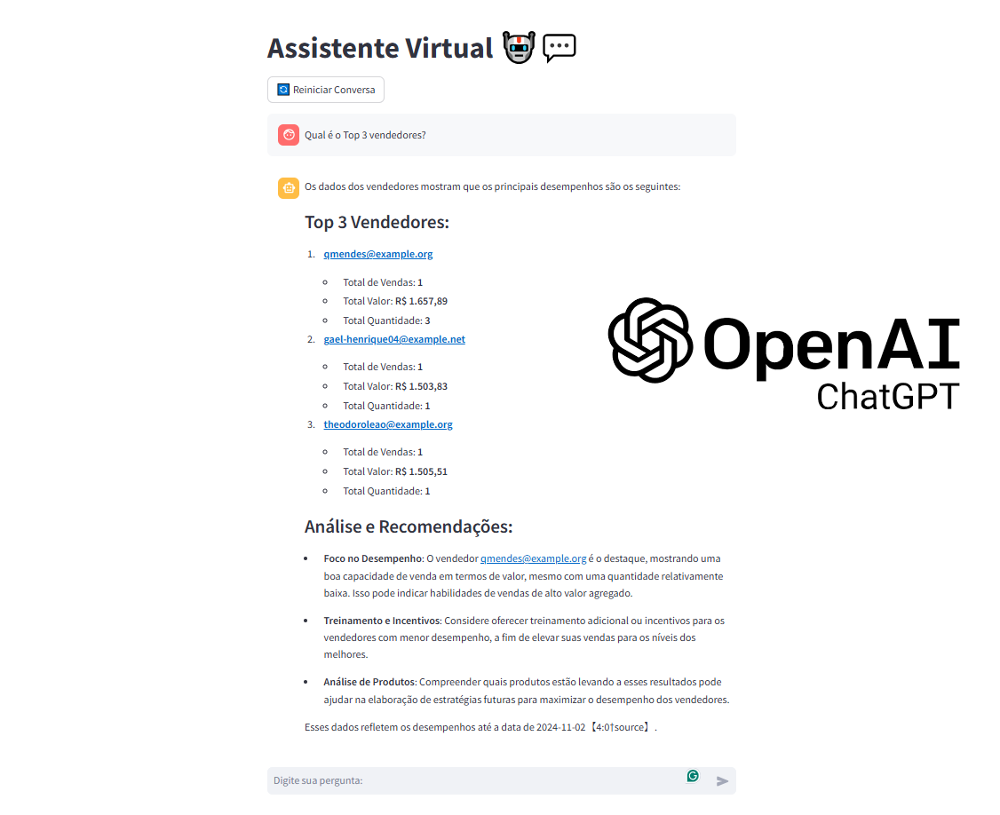
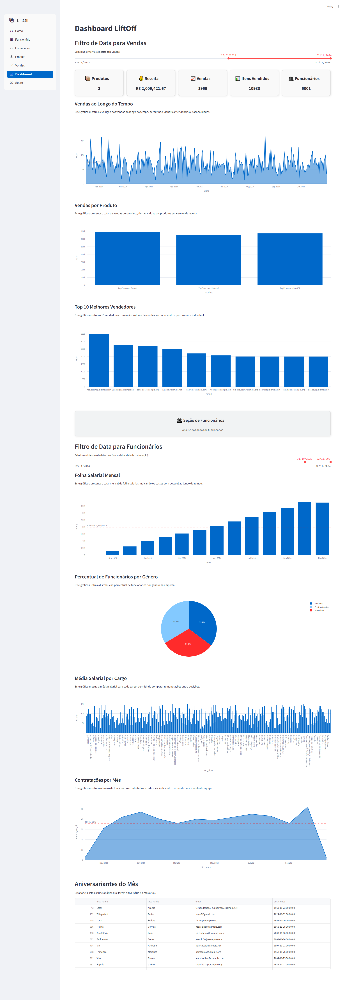
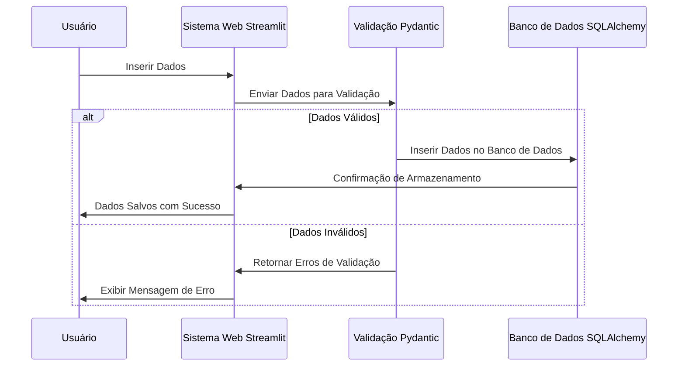
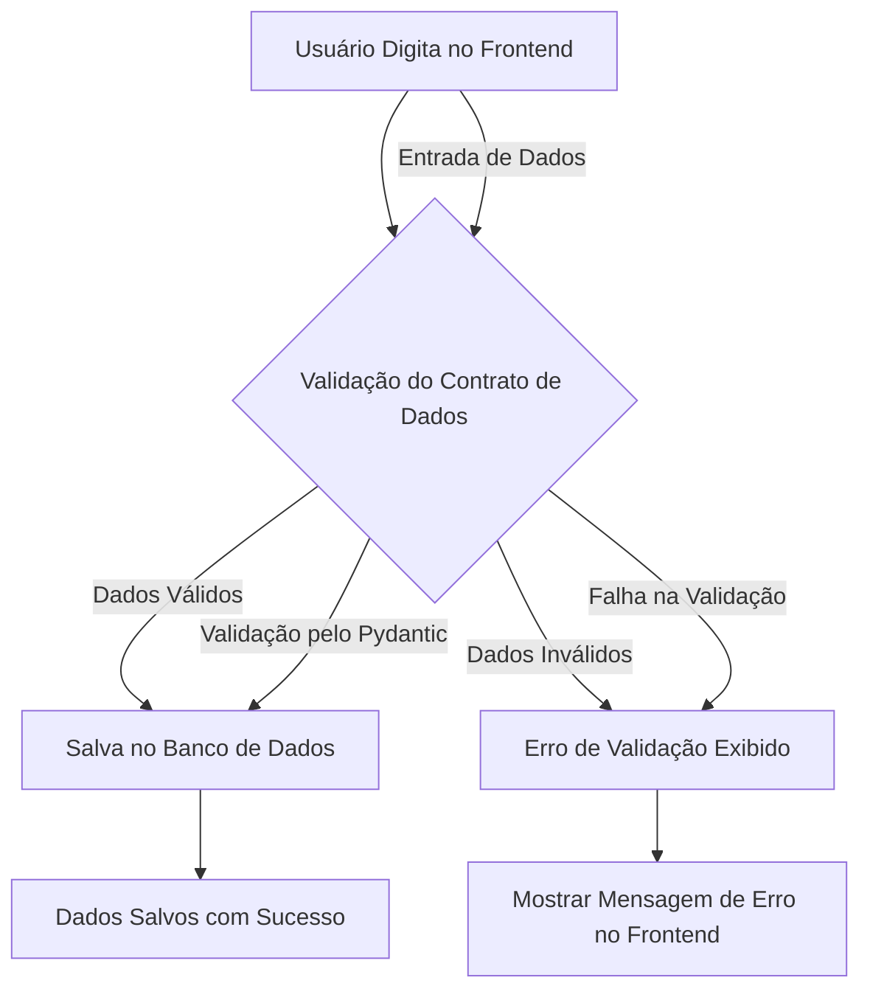
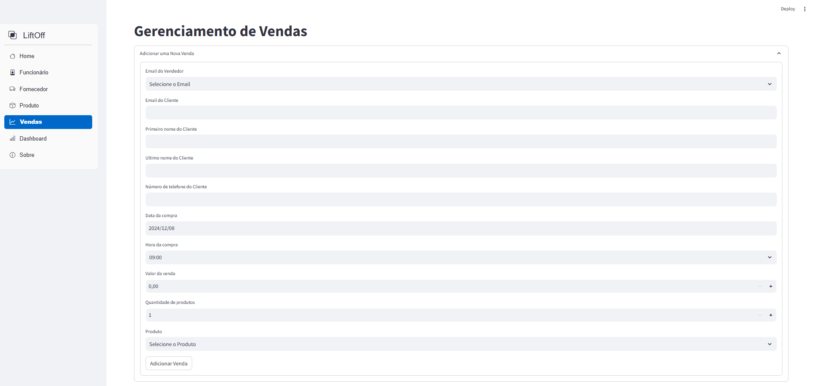
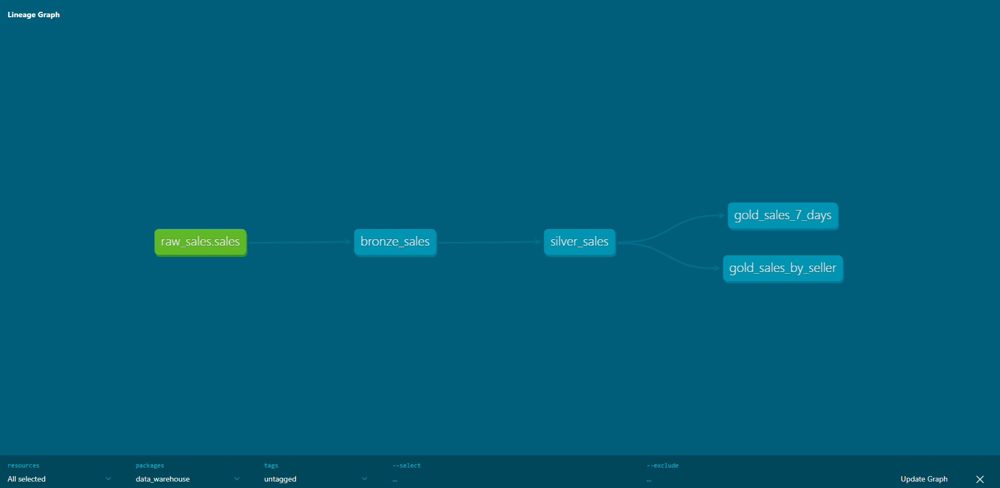
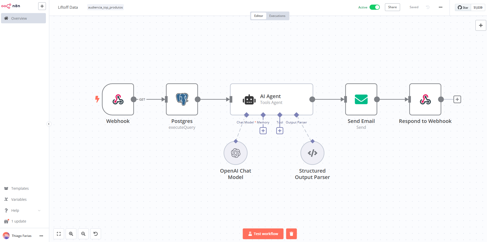
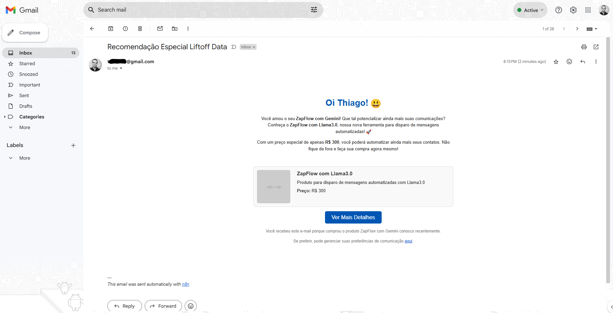
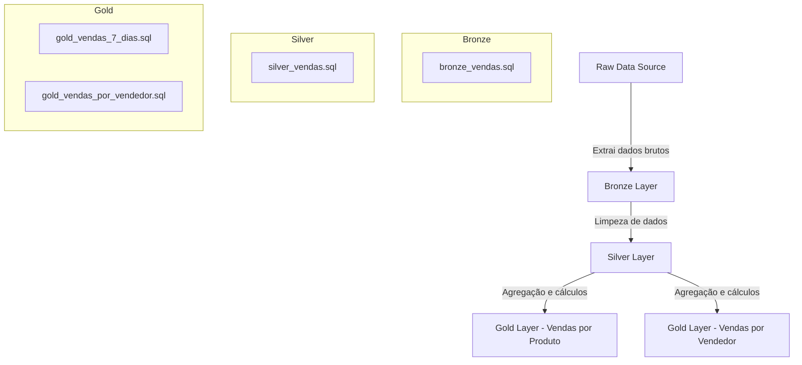

<h1 align="center">📊 LiftOff Data</h1> 
<div align="center">
    <a href="https://www.python.org/" target="_blank"></a>
    <a href="https://www.postgresql.org/docs/" target="_blank"></a>
    <a href="https://fastapi.tiangolo.com/" target="_blank"></a>
    <a href="https://streamlit.io/" target="_blank"></a>
    <a href="https://www.sqlalchemy.org/" target="_blank"></a>
    <a href="https://pydantic-docs.helpmanual.io/" target="_blank"></a>
    <a href="https://docs.docker.com/" target="_blank"></a>
</div>


> Este projeto apresenta uma arquitetura de pipeline de dados de baixo custo, projetada para startups que precisam processar e analisar dados de vendas de forma eficiente.

---

### **Introdução**

Este projeto descreve uma arquitetura de pipeline de dados de baixo custo voltada para startups, com foco em integração de dados de vendas a partir de APIs e CRMs, utilizando tecnologias modernas e acessíveis. O objetivo é criar uma solução escalável para ingestão, transformação e visualização de dados, garantindo que tanto engenheiros de dados quanto analistas possam colaborar eficientemente. A arquitetura proposta inclui a divisão do pipeline em múltiplas camadas (Bronze, Silver e Gold), integração com APIs, Airbyte para ingestão de dados, Airflow para orquestração e DBT para transformação de dados. A plataforma colaborativa "Briefer" também é integrada, permitindo que analistas de dados acessem e utilizem os dados transformados de forma eficiente.

<p align="center">

</p>

#### **Assistente IA Especialista em Analise de Dados e Vendas**
Além do pipeline de dados, o projeto inclui uma interface de assistente AI no Streamlit, que possibilita interagir com um modelo de IA, como ChatGPT ou Llama3. Essa interface oferece uma experiência prática para análise de vendas e insights, permitindo que analistas façam perguntas e obtenham respostas rápidas e insights relevantes.

<p align="center">

</p>

#### **Dashboard Interativo**

Como parte da solução, desenvolvemos um **dashboard interativo** utilizando o Streamlit, que permite visualizar e analisar os dados de vendas e recursos humanos de forma intuitiva e eficiente. O dashboard apresenta métricas-chave, gráficos interativos e tabelas informativas, facilitando a tomada de decisões baseadas em dados.

**Principais funcionalidades do dashboard:**

- **Vendas ao Longo do Tempo:** Gráfico que mostra a evolução das vendas, ajudando a identificar tendências e sazonalidades.
- **Vendas por Produto:** Análise dos produtos mais vendidos, destacando quais geram mais receita.
- **Top 10 Melhores Vendedores:** Ranking dos vendedores com maior volume de vendas, reconhecendo a performance individual.
- **Folha Salarial Mensal:** Acompanhamento dos custos mensais com salários, monitorando a evolução da folha de pagamento.
- **Distribuição de Funcionários por Gênero:** Visualização da composição da equipe, promovendo insights sobre diversidade.
- **Média Salarial por Cargo:** Comparação das remunerações médias entre diferentes posições na empresa.
- **Contratações por Mês:** Gráfico que evidencia o ritmo de crescimento da equipe ao longo do tempo.
- **Aniversariantes do Mês:** Lista dos funcionários que fazem aniversário no mês atual, fortalecendo o engajamento interno.

<p align="center">

</p>

O dashboard foi projetado para ser acessível e fácil de usar, permitindo que membros da equipe sem conhecimento técnico aprofundado possam explorar e interpretar os dados disponíveis.

### **Sequence Diagram**

O diagrama abaixo ilustra a interação entre as principais camadas e componentes da arquitetura, desde a ingestão dos dados brutos até sua transformação e disponibilização para análise.


O diagrama a seguir descreve o fluxo de dados desde a entrada do usuário no frontend até a validação dos dados e o salvamento no banco de dados, se aprovado.



---

### **Tecnologias Utilizadas**

#### PostgreSQL com pg_duckdb
- **Descrição:** O PostgreSQL é um dos bancos de dados relacionais de código aberto mais robustos e amplamente adotados no mercado. Com a extensão pg_duckdb, ele ganha a capacidade de executar consultas analíticas complexas em um armazenamento colunar otimizado, combinando a escalabilidade e a confiabilidade do PostgreSQL com a performance analítica da DuckDB.
- **Uso no Projeto:** Utilizado como banco de dados principal e para operações analíticas de grande volume, permitindo que consultas intensivas sejam processadas de forma mais rápida e eficiente.

#### FastAPI com Swagger
- **Descrição:** FastAPI é um framework moderno e de alto desempenho para a construção de APIs com Python 3.6+ baseado em tipos de dados. Ele é projetado para ser rápido e fácil de usar, oferecendo validação automática de dados e documentação interativa.
- **Uso no Projeto:** Utilizado para criar a API que manipula dados de funcionários, produtos e vendas. O FastAPI gera automaticamente a documentação da API utilizando Swagger, permitindo que os desenvolvedores testem as endpoints diretamente pela interface.
- **Acessando o Swagger:** Após iniciar a aplicação com o comando `uvicorn main:app --reload`, a documentação do Swagger pode ser acessada em `http://127.0.0.1:8000/docs`.

#### **Streamlit**

- **Descrição:** Streamlit é uma biblioteca Python de código aberto que permite a criação de aplicativos web interativos de forma rápida e fácil. Utilizado principalmente para construir dashboards e interfaces de dados, o Streamlit é ideal para prototipagem rápida e visualização de dados sem a necessidade de conhecimentos avançados em desenvolvimento web.
- **Uso no Projeto:** Utilizado para construir o frontend da aplicação, permitindo que os usuários insiram dados de vendas, fornecedores, funcionários e produtos de forma interativa e visualizem os resultados diretamente na interface, por meio de um dashboard.

<p align="center">
  
</p>

#### **Pydantic**

- **Descrição:** Pydantic é uma biblioteca de validação de dados que utiliza modelos baseados em classes Python para garantir que os dados inseridos estejam no formato correto. É amplamente utilizada para validação e serialização de dados, garantindo integridade e consistência.
- **Uso no Projeto:** Pydantic é utilizado para validar os dados inseridos pelos usuários no frontend, garantindo que as informações estejam corretas antes de serem processadas e salvas no banco de dados.

#### **Psycopg2**

- **Descrição:** Psycopg2 é uma biblioteca que permite a interação com bancos de dados PostgreSQL diretamente através de Python, facilitando a execução de comandos SQL e o gerenciamento das conexões.
- **Uso no Projeto:** Utilizado para conectar a aplicação ao banco de dados PostgreSQL, executar comandos SQL, e salvar os dados validados.

#### **SQLAlchemy**

- **Descrição:** SQLAlchemy é uma poderosa biblioteca de SQL toolkit e ORM (Object-Relational Mapping) para Python. Ele permite a interação com bancos de dados relacionais de forma mais intuitiva, utilizando objetos Python em vez de comandos SQL diretamente.
- **Uso no Projeto:** SQLAlchemy foi utilizado para gerenciar a conexão com o banco de dados PostgreSQL e facilitar as operações de CRUD.

#### **MkDocs**

- **Descrição:** MkDocs é uma ferramenta estática de documentação em Python que permite a criação de sites de documentação de forma simples e estruturada. É especialmente útil para projetos que precisam de uma documentação clara e acessível para os desenvolvedores e usuários.
- **Uso no Projeto:** MkDocs é utilizado para gerar a documentação do sistema, detalhando como o projeto foi estruturado, as funcionalidades desenvolvidas, e como o sistema deve ser mantido e atualizado.
- **Configuração e Execução:**
  1. Para visualizar a documentação localmente, execute: `mkdocs serve`
  2. Acesse a documentação em: `http://127.0.0.1:8000/`

<p align="center">
  
</p>

#### **MinIO**
- **Descrição:** MinIO é uma solução de armazenamento de objetos de código aberto compatível com o protocolo Amazon S3, ideal para o armazenamento escalável de grandes volumes de dados. Ele permite o uso local de serviços de armazenamento distribuído para dados não estruturados, como arquivos, logs e objetos de dados.
- **Uso no Projeto:** No contexto deste projeto, MinIO é utilizado para armazenar dados brutos de produtos, funcionarios e fornecedores, por exempo: imagens, documentos em pdf. Ele serve como a camada de armazenamento persistente dos dados nas fases de ingestão e transformação.

#### **Airbyte**

- **Descrição:** Airbyte é uma plataforma de integração de dados de código aberto que permite conectar facilmente APIs, bancos de dados e outros sistemas para ingestão de dados em tempo real.
- **Uso no Projeto:** Responsável pela ingestão de dados a partir de diferentes APIs e fontes de dados, garantindo que os dados sejam movidos para as camadas corretas do pipeline.

#### **Airflow**

- **Descrição:** Apache Airflow é uma plataforma de orquestração de workflows que permite o agendamento e monitoramento de pipelines de dados.
- **Uso no Projeto:** Orquestra a execução de todos os componentes do pipeline, desde a ingestão até a transformação dos dados.

#### **DBT**

- **Descrição:** DBT (Data Build Tool) é uma ferramenta de transformação de dados que permite a construção de modelos SQL e a aplicação de boas práticas de desenvolvimento de software ao ETL.
- **Uso no Projeto:** Utilizado para transformar os dados das camadas Bronze e Silver, preparando-os para a camada Gold, onde estarão prontos para consumo pelos analistas.

<p align="center">

</p>

#### **Briefer**

- **Descrição:** Briefer é uma plataforma colaborativa de dados que permite que equipes de analistas acessem, compartilhem e analisem dados de maneira colaborativa.
- **Uso no Projeto:** Facilita o acesso e a exploração dos dados transformados pelos analistas, proporcionando um ambiente colaborativo para análise de dados.

<p align="center">

</p>

#### **n8n**

- **Descrição:** n8n é uma plataforma de automação de código aberto que permite criar workflows integrando diferentes ferramentas e serviços. Com uma interface visual intuitiva, é possível configurar processos complexos sem necessidade de codificação extensiva.
- **Uso no Projeto:** Utilizado para criar um fluxo automatizado que:
  1. Executa uma query no PostgreSQL para gerar uma audiência personalizada baseada nos produtos vendidos.
  2. Através de um Assistente IA com modelo chatpgt 4, é gerado um copy personalizado para o email marketing da audiência gerado no passo anterior.
  2. Envia informações de audiência personalizada diretamente para WhatsApp, Telegram e e-mail, facilitando a comunicação e engajamento com clientes.

<p align="center">

</p>

### Descrição da Audiência Personalizada:

Essa audiência identifica clientes com base em suas compras recentes (últimos 3 dias) e recomenda o produto mais vendido na mesma categoria, excluindo o produto que já adquiriram. O objetivo é alavancar vendas adicionais por meio de recomendações personalizadas, utilizando insights das tendências de vendas dentro de categorias específicas.

A lógica utilizada para gerar essa audiência é implementada na seguinte query:

```sql
WITH category_top_products AS (
    SELECT 
        p.categoria,
        s.name_product,
        p.description,
        p.price,
        COUNT(s.id) AS total_sales
    FROM sales AS s
    INNER JOIN products AS p ON p.name = s.name_product
    WHERE s.date >= CURRENT_DATE - INTERVAL '3 month'
    GROUP BY p.categoria, s.name_product, p.description, p.price
    ORDER BY p.categoria, total_sales DESC
),
customer_last_purchase AS (
    SELECT 
        s.email_customer,
        s.first_name,
        s.last_name,
        s.phone_number,
        s.name_product AS last_purchased_product,
        p.categoria AS last_purchased_category
    FROM sales AS s
    INNER JOIN products AS p ON p.name = s.name_product
    WHERE s.date >= CURRENT_DATE - INTERVAL '3 days'
),
recommended_products AS (
    SELECT 
        clp.email_customer,
        clp.first_name,
        clp.last_name,
        clp.phone_number,
        clp.last_purchased_product,
        clp.last_purchased_category,
        ctp.name_product AS recommended_product,
        ctp.description AS recommended_description,
        ctp.price AS recommended_price
    FROM customer_last_purchase AS clp
    INNER JOIN category_top_products AS ctp 
        ON clp.last_purchased_category = ctp.categoria
        AND clp.last_purchased_product <> ctp.name_product
)
SELECT DISTINCT ON (email_customer) *
FROM recommended_products
ORDER BY email_customer, recommended_price DESC;
```

Email de exemplo enviado ao cliente com uma recomendação personalizada utilizando n8n e Assistente IA especializado em Copy e Email Marketing:
<p align="center">

</p>

### Importância:

1. **Personalização**: Oferece uma experiência personalizada ao cliente, aumentando a probabilidade de engajamento e compra.
2. **Maximização de Vendas**: Promove produtos populares dentro da mesma categoria, otimizando o cross-selling e impulsionando a receita.
3. **Insights Baseados em Dados**: Utiliza tendências de vendas históricas para identificar produtos com maior potencial de sucesso.
4. **Satisfação do Cliente**: Reforça a percepção de valor da marca ao sugerir produtos alinhados às preferências dos clientes.

Essa abordagem é essencial para negócios que desejam aumentar a conversão e fortalecer a fidelidade dos clientes, aproveitando dados históricos e padrões de comportamento.

---

### **Estrutura do Projeto**

#### **Divisão dos Módulos**

O projeto está dividido em módulos para organizar melhor o desenvolvimento e facilitar a manutenção futura. A seguir, estão os principais módulos do projeto:

1. **Frontend (`app.py`):**
   - Responsável pela interface do usuário onde os dados de vendas são inseridos e exibidos.
   - Desenvolvido com Streamlit para proporcionar uma interação simples e amigável.

2. **Contrato (`<model_name>_schema.py.py`):**
   - Define as regras de validação dos dados utilizando Pydantic.
   - Assegura que os dados inseridos no frontend estão no formato correto e cumprem as regras estabelecidas pelo sistema.

3. **Banco de Dados (`database.py`):**
   - Gerencia a conexão e as operações com o banco de dados PostgreSQL utilizando Psycopg2.
   - Facilita a interação com o banco sem a necessidade de escrever SQL diretamente.

### Diagrama de Fluxo das Camadas Bronze, Silver e Gold no DBT

O pipeline de dados é dividido em três camadas principais para garantir a qualidade e integridade dos dados à medida que eles progridem no sistema:



### Explicação do Diagrama

- **Bronze Layer:** Esta camada recebe os dados brutos diretamente das fontes, criando uma visualização inicial sem transformações significativas.
  
- **Silver Layer:** Nesta etapa, os dados são limpos, ajustando datas inválidas e removendo outliers. É a fase em que os dados começam a ser preparados para análise.

- **Gold Layer:** Dados finais prontos para análise e visualização, acessíveis por ferramentas como o Briefer.
  - **Gold Vendas por Produto:** Agrega e calcula os dados para apresentar o desempenho dos produtos nos últimos 7 dias.
  - **Gold Vendas por Vendedor:** Apresenta o desempenho dos vendedores, também focando nos últimos 7 dias.

---

### **Passos para Configuração e Execução**

## Instalação via Docker
1. Antes de rodar o Docker, crie um arquivo `.env` na raiz do projeto com os seguintes valores:

```plaintext
DB_HOST_PROD = postgres
DB_PORT_PROD = 5432
DB_NAME_PROD = mydatabase
DB_USER_PROD = user
DB_PASS_PROD = password
PGADMIN_EMAIL = email_pgadmin
PGADMIN_PASSWORD = password_pgadmin

OPENAI_API_KEY= api_key
GROQ_API_KEY= api_key
```

2. Para iniciar a aplicação, execute:

```bash
docker-compose up -d --build
```

### **Geração de Dados Fake e Inserção no Banco de Dados**
Este projeto inclui um pipeline para geração e inserção de dados fictícios de forma automatizada:
- **Geração de dados com Faker**: os scripts utilizam a biblioteca Faker para criar dados de teste em escala realista para várias tabelas de negócios, incluindo `employees`, `products`, `sales`, e `suppliers`.
- **Inserção no PostgreSQL**: os dados gerados são salvos em arquivos Parquet e carregados diretamente no banco de dados PostgreSQL usando DuckDB, com ajuste de sequências para prevenir problemas de IDs duplicados.

#### **Passos para Gerar e Inserir os Dados no Banco de Dados**

1. Acesse o container `backend` para executar os scripts de geração e carregamento de dados:
    ```bash
    docker-compose exec backend sh
    ```

2. Execute os seguintes comandos para gerar e inserir os dados:

    - Gerar dados em formato Parquet:
        ```bash
        python generate_dataset/generate_raw.py
        ```

    - Inserir os dados gerados no PostgreSQL:
        ```bash
        python generate_dataset/load_raw_to_postgres.py
        ```

3. **Executar DBT para Processamento de Dados**  
   Para rodar o DBT (Data Build Tool) e transformar os dados, execute:
   ```bash
   cd app/backend/data_warehouse/
   dbt run # ou dbt --log-level debug run
   ```

4. **Gerar Arquivos para o Assistente OpenAI**  
   Para extrair dados e criar arquivos JSON que serão utilizados pelo assistente OpenAI:
   ```bash
   docker-compose exec frontend sh
   python AI/extract_data_json.py
   python AI/create_assistent_exemplo.py
   ```

5. **Criar o Assistente de IA na OpenAI**
Para configurar o projeto e permitir que ele se comunique com o assistente de IA, é necessário criar um assistente personalizado na plataforma da OpenAI e recuperar o `ASSISTANT_ID`. Este ID será usado para vincular o código ao assistente que você criou, garantindo que todas as funcionalidades de IA estejam operacionais.

- **Passo a Passo:**
  1. Acesse a plataforma da OpenAI e navegue até a seção de **Assistentes de IA**.
  2. Crie um novo assistente com as configurações desejadas, de acordo com os requisitos do projeto. (faça o upload dos arquivos .json também)
  3. Ao finalizar a criação, copie o `ASSISTANT_ID` fornecido.

- **Configuração do Código:**
  1. Abra o arquivo `app/frontend/AI/main.py`.
  2. Localize a variável `ASSISTANT_ID` e substitua o valor pelo `ASSISTANT_ID` copiado da plataforma da OpenAI.
  
  Exemplo:
  ```python
  ASSISTANT_ID = "seu_assistant_id_aqui"
  ```

#### **Prompt do Assistente de Vendas**

> **Assistente Especializado em Vendas**  
> Você é um especialista em análise e insights para equipes de vendas, focado em otimizar o desempenho de vendas, gerenciar estoques de maneira eficiente e melhorar o relacionamento com fornecedores. Sua expertise abrange a análise de dados de produtos, avaliação de desempenho de vendedores, produtividade dos funcionários e gestão de fornecedores.
>
> Para cada solicitação, responda com um resumo direto e insights práticos, seguidos de recomendações detalhadas.  
> A linguagem deve ser profissional, objetiva e prática, utilizando gráficos e visualizações sempre que possível para facilitar a compreensão dos dados.

---

### **6. Abrir a Interface do Assistente AI no Streamlit**  
   Para acessar a interface do assistente especializada em análise de vendas e insights:
   ```bash
   streamlit run app/frontend/AI/main.py
   ```

### **7. Executar o Frontend**

Este projeto oferece uma interface visual desenvolvida em Streamlit, onde é possível visualizar e interagir com os dados carregados.

- **Comando para iniciar o frontend no Streamlit** (disponível em [http://localhost:8501/](http://localhost:8501/)):
```bash
streamlit run app/frontend/app.py
```

--- 


### **Conclusão**

Este projeto de arquitetura de pipeline de dados para startups oferece uma solução eficiente, escalável e de baixo custo para lidar com o processamento e análise de grandes volumes de dados de vendas. Com a utilização de ferramentas modernas como Airbyte, Airflow, DBT e Briefer, o pipeline garante a ingestão, transformação e disponibilização dos dados em camadas organizadas (Bronze, Silver, Gold), permitindo uma análise colaborativa e em tempo real.

Essa arquitetura modular e flexível facilita a adaptação e o crescimento conforme a demanda aumenta, tornando-se uma excelente escolha para startups que precisam otimizar seus processos de dados sem comprometer o orçamento.

