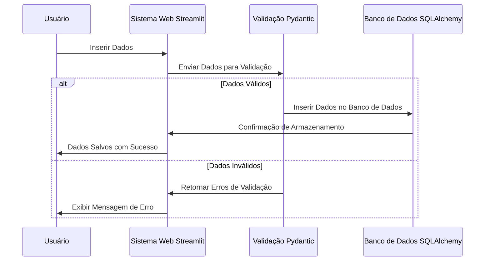

<h1 align="center">📊 LiftOff Data</h1> 

> Este projeto apresenta uma arquitetura de pipeline de dados de baixo custo, projetada para startups que precisam processar e analisar dados de vendas de forma eficiente.

---

### **Introdução**

Este projeto descreve uma arquitetura de pipeline de dados de baixo custo voltada para startups, com foco em integração de dados de vendas a partir de APIs e CRMs, utilizando tecnologias modernas e acessíveis. O objetivo é criar uma solução escalável para ingestão, transformação e visualização de dados, garantindo que tanto engenheiros de dados quanto analistas possam colaborar eficientemente. A arquitetura proposta inclui a divisão do pipeline em múltiplas camadas (Raw, Bronze, Silver e Gold), integração com APIs, Kafka para streaming, Airbyte para ingestão de dados, Airflow para orquestração e DBT para transformação de dados. A plataforma colaborativa "Briefer" também é integrada, permitindo que analistas de dados acessem e utilizem os dados transformados de forma eficiente.

### **Sequence Diagram**

O diagrama abaixo ilustra a interação entre as principais camadas e componentes da arquitetura, desde a ingestão dos dados brutos até sua transformação e disponibilização para análise.



---

### **Tecnologias Utilizadas**

#### **Streamlit**

- **Descrição:** Streamlit é uma biblioteca Python de código aberto que permite a criação de aplicativos web interativos de forma rápida e fácil. Utilizado principalmente para construir dashboards e interfaces de dados, o Streamlit é ideal para prototipagem rápida e visualização de dados sem a necessidade de conhecimentos avançados em desenvolvimento web.
- **Uso no Projeto:** Utilizado para construir o frontend da aplicação, permitindo que os usuários insiram dados de vendas de forma interativa e visualizem os resultados diretamente na interface.

#### **Pydantic**

- **Descrição:** Pydantic é uma biblioteca de validação de dados que utiliza modelos baseados em classes Python para garantir que os dados inseridos estejam no formato correto. É amplamente utilizada para validação e serialização de dados, garantindo integridade e consistência.
- **Uso no Projeto:** Pydantic é utilizado para validar os dados inseridos pelos usuários no frontend, garantindo que as informações estejam corretas antes de serem processadas e salvas no banco de dados.

#### **Psycopg2**

- **Descrição:** Psycopg2 é uma biblioteca que permite a interação com bancos de dados PostgreSQL diretamente através de Python, facilitando a execução de comandos SQL e o gerenciamento das conexões.
- **Uso no Projeto:** Utilizado para conectar a aplicação ao banco de dados PostgreSQL, executar comandos SQL, e salvar os dados validados.

#### **SQLAlchemy (Opcional)**

- **Descrição:** SQLAlchemy é uma poderosa biblioteca de SQL toolkit e ORM (Object-Relational Mapping) para Python. Ele permite a interação com bancos de dados relacionais de forma mais intuitiva, utilizando objetos Python em vez de comandos SQL diretamente.
- **Uso no Projeto:** SQLAlchemy poderia ser utilizado para gerenciar a conexão com o banco de dados PostgreSQL e facilitar as operações de CRUD (opcional, não implementado no exemplo atual).

#### **MkDocs**

- **Descrição:** MkDocs é uma ferramenta estática de documentação em Python que permite a criação de sites de documentação de forma simples e estruturada. É especialmente útil para projetos que precisam de uma documentação clara e acessível para os desenvolvedores e usuários.
- **Uso no Projeto:** MkDocs é utilizado para gerar a documentação do sistema, detalhando como o projeto foi estruturado, as funcionalidades desenvolvidas, e como o sistema deve ser mantido e atualizado.

#### **Airbyte**

- **Descrição:** Airbyte é uma plataforma de integração de dados de código aberto que permite conectar facilmente APIs, bancos de dados e outros sistemas para ingestão de dados em tempo real.
- **Uso no Projeto:** Responsável pela ingestão de dados a partir de diferentes APIs e fontes de dados, garantindo que os dados sejam movidos para as camadas corretas do pipeline.

#### **Kafka**

- **Descrição:** Apache Kafka é uma plataforma de streaming distribuída que permite a publicação e assinatura de fluxos de dados em tempo real.
- **Uso no Projeto:** Utilizado para gerenciar o fluxo de dados de maneira escalável e garantir que os dados sejam processados de forma contínua e eficiente.

#### **Airflow**

- **Descrição:** Apache Airflow é uma plataforma de orquestração de workflows que permite o agendamento e monitoramento de pipelines de dados.
- **Uso no Projeto:** Orquestra a execução de todos os componentes do pipeline, desde a ingestão até a transformação dos dados.

#### **DBT**

- **Descrição:** DBT (Data Build Tool) é uma ferramenta de transformação de dados que permite a construção de modelos SQL e a aplicação de boas práticas de desenvolvimento de software ao ETL.
- **Uso no Projeto:** Utilizado para transformar os dados das camadas Raw, Bronze e Silver, preparando-os para a camada Gold, onde estarão prontos para consumo pelos analistas.

#### **Briefer**

- **Descrição:** Briefer é uma plataforma colaborativa de dados que permite que equipes de analistas acessem, compartilhem e analisem dados de maneira colaborativa.
- **Uso no Projeto:** Facilita o acesso e a exploração dos dados transformados pelos analistas, proporcionando um ambiente colaborativo para análise de dados.

---

### **Estrutura do Projeto**

#### **Divisão dos Módulos**

O projeto está dividido em módulos para organizar melhor o desenvolvimento e facilitar a manutenção futura. A seguir, estão os principais módulos do projeto:

1. **Frontend (`app.py`):**
   - Responsável pela interface do usuário onde os dados de vendas são inseridos e exibidos.
   - Desenvolvido com Streamlit para proporcionar uma interação simples e amigável.

2. **Contrato (`contrato.py`):**
   - Define as regras de validação dos dados utilizando Pydantic.
   - Assegura que os dados inseridos no frontend estão no formato correto e cumprem as regras estabelecidas pelo sistema.

3. **Banco de Dados (`database.py`):**
   - Gerencia a conexão e as operações com o banco de dados PostgreSQL utilizando Psycopg2.
   - Facilita a interação com o banco sem a necessidade de escrever SQL diretamente.

#### **Divisão em Camadas**

O pipeline de dados é dividido em quatro camadas principais para garantir a qualidade e integridade dos dados à medida que eles progridem no sistema:

1. **Camada Raw:**
   - Dados brutos, não processados, diretamente das fontes de dados (APIs e CRM).
   
2. **Camada Bronze:**
   - Dados validados e padronizados após a ingestão, prontos para serem processados.

3. **Camada Silver:**
   - Dados limpos e transformados com regras de negócio aplicadas.

4. **Camada Gold:**
   - Dados finais prontos para análise e visualização, acessíveis por ferramentas como o Briefer.

---

### **Passos para Configuração e Execução**

### **Passos para Configuração e Execução**

#### **1. Criar o Repositório**

- **Passo:** Inicie um novo repositório no GitHub ou GitLab para versionar o projeto.
- **Comando:**
  ```bash
  git init
  ```

#### **2. Escolher a Versão do Python para 3.12.3**

- Utilize `pyenv` para gerenciar e definir a versão correta do Python:
  ```bash
  pyenv install 3.12.3
  pyenv local 3.12.3
  ```

#### **3. Criar um Ambiente Virtual**

- **Passo:** Crie um ambiente virtual para isolar as dependências do projeto.
- **Comando:**
  ```bash
  python3.12 -m venv .venv
  ```

#### **4. Entrar no Ambiente Virtual**

- **Comando:**
  - **Windows:**
    ```bash
    .venv\Scripts\activate
    ```
  - **Linux/Mac:**
    ```bash
    source .venv/bin/activate
    ```

#### **5. Instalar as Dependências**

- **Instalar os pacotes necessários:**
  ```bash
  pip install -r requirements.txt
  ```

#### **6. Executar o Frontend**

- **Comando para rodar o frontend com Streamlit:**
  ```bash
  streamlit run app.py
  ```

#### **7. Configurar o PostgreSQL**

- **Criar o banco de dados e a tabela necessária:**
  ```sql
  CREATE DATABASE crm_vendas;
  CREATE TABLE vendas (
      id SERIAL PRIMARY KEY,
      email VARCHAR(255) NOT NULL,
      data TIMESTAMP NOT NULL,
      valor NUMERIC NOT NULL,
      quantidade INTEGER NOT NULL,
      produto VARCHAR(50) NOT NULL
  );
  ```

#### **8. Criar a Conexão com o PostgreSQL**

- A conexão é gerenciada no módulo `database.py` utilizando `psycopg2`.

### **Conclusão**

Este projeto de arquitetura de pipeline de dados para startups oferece uma solução eficiente, escalável e de baixo custo para lidar com o processamento e análise de grandes volumes de dados de vendas. Com a utilização de ferramentas modernas como Airbyte, Kafka, Airflow, DBT e Briefer, o pipeline garante a ingestão, transformação e disponibilização dos dados em camadas organizadas (Raw, Bronze, Silver, Gold), permitindo uma análise colaborativa e em tempo real.

Essa arquitetura modular e flexível facilita a adaptação e o crescimento conforme a demanda aumenta, tornando-se uma excelente escolha para startups que precisam otimizar seus processos de dados sem comprometer o orçamento.